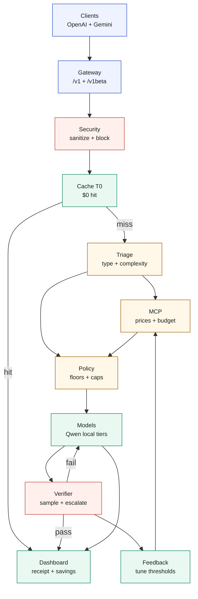

# TokenTriage — Agent FinOps Control Plane

> Route every AI-agent task to the cheapest sufficient model, prove the
> savings, and enforce production cost/security policy.

TokenTriage is an OpenAI + Gemini-compatible routing gateway for LLM-powered
agents. It triages each task, checks cache/policy/budget, dispatches to the
cheapest sufficient tier, verifies sampled cheap-tier answers, and records a
cost receipt against an always-frontier Gemini baseline.

The cheap tiers run on local open-source Ollama models by default, so the
judge demo works with no cloud keys. Gemini can also be used as an optional
backend tier, and Gemini-style clients can call TokenTriage through
`/v1beta/models/{model}:generateContent`.

**Capstone:** Kaggle × Google — AI Agents: Intensive Vibe Coding (Track: Agents for Business)

---

## Visual proof for judges

Run one command and open the three judge surfaces:

```bash
tokentriage serve
open http://localhost:8000/chat
open http://localhost:8000/dashboard
open http://localhost:8000/architecture
```

| Surface | Why it matters |
|---|---|
| **Chat** | Live routing trace, model dispatch, cache hit/miss, and receipt per request |
| **Dashboard** | Spend, all-frontier baseline, savings, dispatch latency, cache hits, escalations, recent decisions |
| **Interactive Architecture** | Clickable system map with scenario paths for cache hit, cheap route, sensitive escalation, and security block |

No models available during judging? Seed a deterministic replay without
Ollama, Gemini, or OpenAI:

```bash
tokentriage judge-mode
tokentriage serve
open http://localhost:8000/chat       # select "Judge replay" from history
open http://localhost:8000/dashboard  # spend, savings, latency, cache proof
```

## The killer metric: 98.1% lower inference cost

Real run: 30-query business workload, all tiers on local open-source models
(Apple M4), measured against sending every task to `gemini-2.5-pro`.

| Metric | Always-frontier | TokenTriage | Improvement |
|---|---:|---:|---:|
| Modeled cost | $0.08892 | **$0.00172** | **98.1% lower** |
| Cache hits | 0 | 3 / 30 | free reuse |
| Verification escalations | n/a | 1 | quality protected |
| Cloud keys required | yes | no | local-first demo |

Generate fresh evidence:

```bash
tokentriage evidence
open reports/latest/dashboard.html
```

## Judge demo

The primary demo UI is TokenTriage's own gateway playground. Each request shows
the final answer plus a visible routing chain: security, cache, triage, policy,
dispatch, verification, and savings receipt.

```bash
tokentriage serve            # http://localhost:8000/chat
```

The dashboard remains available from the same server:

```bash
open http://localhost:8000/dashboard
open http://localhost:8000/architecture
tokentriage demo             # seed curated dashboard traffic
tokentriage judge-mode       # no-key replay if local models are unavailable
```

Evidence and writeups:

- `http://localhost:8000/architecture` — interactive runtime architecture map
- `reports/latest/dashboard.html` — offline interactive evidence dashboard
- `docs/CAPSTONE_NARRATIVE.md` — business story and judge pitch
- `docs/SCIENTIFIC_REPORT.md` — benchmark methodology and results
- `docs/SOFTWARE_QUALITY.md` — security, privacy, and architecture audit
- `docs/DEMO_SCRIPT.md` — 3-minute walkthrough

## The problem

Businesses running LLM-powered agents (support bots, ops assistants, copilots)
pay frontier-cloud prices for *every* query — including the large fraction of
tasks a much cheaper model handles correctly. There is no intelligent layer
deciding, per task, which model is *sufficient*. TokenTriage is that layer.

## Architecture

The README view gives judges a visual system map immediately. The live version
is interactive and clickable:

```bash
tokentriage serve
open http://localhost:8000/architecture
```



<details open>
<summary><b>Scenario A: cheap route, maximum savings</b></summary>

`Security Gateway -> Semantic Cache miss -> Triage Agent -> MCP Pricing -> Policy Engine -> Qwen T1 -> Savings Receipt`

Judge takeaway: a simple task stays local and cheap, while the receipt compares
actual cost against the all-frontier Gemini baseline.
</details>

<details>
<summary><b>Scenario B: semantic cache hit, zero model call</b></summary>

`Security Gateway -> Semantic Cache hit -> Savings Receipt`

Judge takeaway: repeat or near-duplicate tasks return at T0, which means no
LLM dispatch and effectively zero model cost.
</details>

<details>
<summary><b>Scenario C: sensitive task, policy-protected escalation</b></summary>

`Security Gateway -> Triage Agent -> Policy min_tier -> Stronger local tier -> Verifier -> Dashboard`

Judge takeaway: legal/financial/medical work cannot be routed below the
configured safety floor just to save money.
</details>

<details>
<summary><b>Scenario D: prompt injection, blocked before spend</b></summary>

`Security Gateway -> Quarantine -> Decision Log`

Judge takeaway: unsafe input is stopped before cache lookup, model dispatch, or
cloud/API spend.
</details>

Savings baseline = **all-cloud-frontier**: what every task *would* cost sent to
a top cloud model (gemini-2.5-pro list price). It is never called — it's the
yardstick. See `docs/architecture.md` for full design rationale.

## Why local + open-source

- **Real $0 cheap tiers.** T1/T2/T3 run on your machine via Ollama — no keys,
  no per-token bill, fully offline.
- **Provider abstraction** (`src/tokentriage/providers.py`): every tier names a
  provider (`ollama` | `gemini` | `openai`). Adding a paid cloud tier is a
  registry edit — nothing above the provider layer changes.
- **Phased:** Phase 1 = all local. Phase 2 = add free-tier Gemini as a tier.
  Phase 3 = add paid OpenAI / Google / Mistral. Same code.

## Key concepts demonstrated (course rubric)

| Concept | Where |
|---|---|
| Multi-agent system (Google ADK) | Triage + Verifier are ADK `LlmAgent`s running on local Ollama via LiteLLM (`TOKENTRIAGE_USE_ADK=1`; see `tokentriage adk-demo`), coordinated by a deterministic orchestrator |
| MCP Server | `src/tokentriage/mcp_server/server.py` — custom pricing/benchmark/budget/log tools |
| Security features | `src/tokentriage/security/` — gateway, injection screen, budget circuit breaker, key isolation, sensitive-task backstop |
| API compatibility | OpenAI `/v1/chat/completions` + Gemini `/v1beta/models/{model}:generateContent` |
| Deployability | FastAPI gateway (`proxy/app.py`), custom chat UI, dashboard, Dockerfile |
| Agent skills (CLI) | `src/tokentriage/cli.py` — serve / benchmark / eval / report / evidence / demo / judge-mode / tune / adk-demo / attack-test |
| Antigravity | Built in the Antigravity IDE (see video) |

**ADK note:** routing/cost/escalation is deterministic *by design* — you don't
want an LLM guessing price tiers. The genuine LLM agents are Triage and
Verifier; both run through the ADK Runner on local models. `tokentriage
adk-demo "<task>"` shows them executing.

## Quickstart (fully local, no API keys)

```bash
# 1. Install Ollama (https://ollama.com) and pull the model tiers (one each)
ollama pull qwen2.5:3b
ollama pull qwen2.5:7b
ollama pull qwen2.5:14b
ollama pull nomic-embed-text

# 2. Install TokenTriage (Python 3.11+)
pip install -e .

# 3. (optional) configure — defaults already run fully local
cp .env.example .env

# 4. Run the gateway + chat/dashboard
tokentriage serve            # http://localhost:8000  ·  /dashboard

# 5. Point any OpenAI-compatible client at it
#    base_url="http://localhost:8000/v1"   (the `model` field is ignored —
#    TokenTriage picks the tier)

# 6. Run the evidence suite vs the all-cloud baseline
tokentriage benchmark
tokentriage report
tokentriage evidence
tokentriage judge-mode       # optional: seed no-key judge replay
```

**Deploy with Docker:** the app image is *not* self-contained — it needs Ollama
reachable at `OLLAMA_HOST`. Use the bundled compose stack:

```bash
docker compose up --build
docker compose exec ollama ollama pull qwen2.5:3b     # + 7b, 14b, nomic-embed-text
```

To add a Gemini cloud tier later: edit a tier in
`src/tokentriage/models/registry.py` (set `provider="gemini"`, a model id, and
its price), then put a key in `.env` (`GEMINI_API_KEY=...`). One shared key
powers any cloud tier; per-tier vars override it for key isolation.

## Configuration

Routing behavior is declarative — edit `config/policy.yaml`, not code:
accuracy floor, latency SLO, daily budget, per-task-type tier overrides
(e.g. `legal_or_financial: min_tier T3`), verification sample rate.

## Security notes

- No keys needed for local operation; cloud keys (if used) via environment
  variables only, with per-tier key isolation.
- Input sanitizer + prompt-injection screen quarantine suspicious requests
  (see `tokentriage attack-test`).
- Budget circuit breaker halts expensive-tier routing at the daily cap.
- **Context privacy** (`policy.yaml` → `privacy`): local tiers always get full
  conversation context (it never leaves the machine); for cloud tiers, history
  is governed by `cloud_context` (`full`/`none`/`last_n`/`summary`, where
  `summary` is produced *locally*). A **sensitive-content firewall** strips any
  legal/financial/medical prior turn so it can never reach a third-party API.

## Repository layout

```
config/policy.yaml          declarative routing policy
src/tokentriage/
  agents/                   orchestrator, triage, verifier
  providers.py              provider abstraction (ollama / gemini / openai)
  mcp_server/               custom MCP server (pricing, benchmarks, budget, logs)
  security/                 gateway + budget circuit breaker
  cache/                    semantic cache (tier 0, $0) — local embeddings
  models/registry.py        model tier registry + cloud baseline reference
  proxy/                    FastAPI OpenAI-compatible gateway + dashboard
  cli.py                    Typer CLI (agent skills)
  db.py                     SQLite persistence
benchmarks/                 30-query suite + baseline
docs/architecture.md        design rationale
```

## Results

Real run: 30-query business workload, all tiers on local open-source models
(Apple M4), measured against the all-cloud-frontier baseline.

| Metric | Value |
|---|---|
| Total cost (TokenTriage, local) | **$0.00172** |
| Total cost (all-cloud-frontier baseline) | $0.08892 |
| **Savings** | **98.1%** |
| Cache hits ($0) | 3 / 30 |
| Verification escalations | 1 |
| Tier utilization (T0/T1/T2/T3) | 3 / 13 / 5 / 9 |

*Baseline = every task sent to gemini-2.5-pro (list price). TokenTriage runs
all tiers on local open-source models, escalating only when the verifier flags
a weak answer. Numbers reproduce via `tokentriage benchmark` (Apple M4).*

## License

MIT
