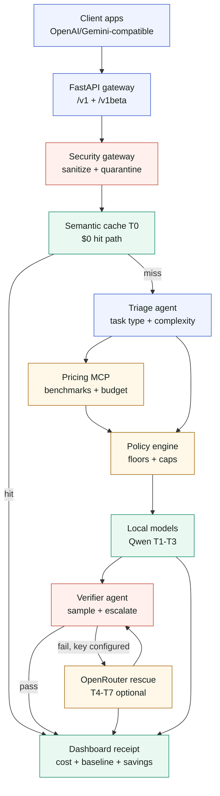

# TokenTriage

**A local-first inference router for AI agents that proves every dollar it saves.**

TokenTriage is a FastAPI gateway that sits between agent apps and LLM providers.
It accepts OpenAI-compatible and Gemini-compatible requests, then decides the
cheapest sufficient route for each task using security checks, semantic cache,
task triage, MCP-backed pricing, policy rules, local model dispatch, verifier
sampling, optional OpenRouter rescue, and a final decision receipt.

The default demo runs locally with Ollama. OpenRouter is optional and is only
used when configured for policy-preferred cloud routes or verifier rescue.

> **Headline result:** 98.1% lower modeled inference cost versus an
> always-frontier Gemini baseline on the bundled business workload.

## Demo Surfaces

Run one server and open the three judge-facing pages:

```bash
tokentriage serve
open http://localhost:8000/chat
open http://localhost:8000/dashboard
open http://localhost:8000/architecture
```

| Page | What it shows |
|---|---|
| `/chat` | Minimal chat UI with live routing trace, local/OpenRouter path, verifier result, and savings receipt |
| `/dashboard` | Spend, baseline, savings, cache hits, provider split, verifier analytics, sorting, filtering, and CSV export |
| `/architecture` | Interactive system map with route scenarios for cheap route, cache hit, quality rescue, sensitive escalation, and security block |

If local models are unavailable during judging, seed a deterministic replay:

```bash
tokentriage judge-mode
tokentriage serve
```

Then open `/chat`, select **Judge replay** from the left history panel, and use
`/dashboard` as the proof ledger.

For the built-in replay controls in the chat UI, start the server directly in
judge mode:

```bash
tokentriage serve --judge-mode
```

## Why This Exists

Most AI-agent workflows send every request to an expensive frontier model. That
is wasteful. Many tasks are simple, repeated, or safely handled by a cheaper
local model.

TokenTriage makes model choice an auditable control plane:

- **T0 semantic cache:** repeated or near-duplicate tasks return with no model call.
- **T1-T3 local models:** Qwen via Ollama handles normal work without API keys.
- **Policy engine:** task-specific accuracy floors, latency limits, sensitive-task rules, and budget caps.
- **Verifier gate:** sampled answers can fail quality checks and escalate.
- **OpenRouter rescue:** optional T4-T7 free cloud catalog for quality rescue or policy-preferred routes.
- **Decision ledger:** every route writes cost, baseline, tier, provider, verifier result, and rationale to SQLite.

## Quickstart

Requirements:

- Python 3.11+
- Ollama for the full local model demo

```bash
pip install -e .

ollama pull qwen2.5:3b
ollama pull qwen2.5:7b
ollama pull qwen2.5:14b
ollama pull nomic-embed-text

cp .env.example .env
tokentriage serve
```

The server binds to `0.0.0.0:8000` by default.

## OpenRouter Is Optional

Leave this blank for **zero OpenRouter/cloud calls**:

```env
OPENROUTER_API_KEY=
```

Set it only when you want the optional rescue catalog:

```env
OPENROUTER_API_KEY=sk-or-v1-...
OPENROUTER_BASE_URL=https://openrouter.ai/api/v1
OPENROUTER_SITE_URL=http://localhost:8000
OPENROUTER_APP_NAME=TokenTriage
```

Current cloud rescue tiers:

| Tier | Model | Role |
|---|---|---|
| T4 | `google/gemma-4-31b-it:free` | General rescue and policy-preferred cloud route |
| T5 | `openai/gpt-oss-20b:free` | Fast fallback rescue |
| T6 | `qwen/qwen3-next-80b-a3b-instruct:free` | Reasoning-heavy rescue |
| T7 | `qwen/qwen3-coder-480b-a35b:free` | Code-heavy rescue |

One OpenRouter key powers the configured rescue catalog. If a cloud tier is
unavailable, rate-limited, or missing a key, TokenTriage falls back to available
local tiers and records the routing event.

## Architecture



The live architecture page is interactive:

```bash
open http://localhost:8000/architecture
```

## Routing Pipeline

Every request follows the same control path:

1. **Security Gateway** sanitizes input and quarantines prompt-injection attempts.
2. **Semantic Cache** checks local Nomic embeddings for a T0 match.
3. **Triage Agent** classifies task type and complexity.
4. **Pricing MCP** exposes benchmark, budget, and price data to the routing layer.
5. **Policy Engine** applies minimum tiers, accuracy floors, latency rules, privacy rules, and budget caps.
6. **Model Dispatch** calls the selected local Ollama tier by default.
7. **Verifier Agent** samples quality and can trigger escalation.
8. **Savings Receipt** records tier, model id, provider, cost, baseline cost, savings, cache hit, verifier result, escalation, and rationale.

## Public Interfaces

```text
POST /v1/chat/completions
POST /v1/route/stream
POST /v1beta/models/{model}:generateContent
GET  /chat
GET  /dashboard
GET  /architecture
GET  /api/stats
GET  /healthz
```

OpenAI-compatible request:

```bash
curl http://localhost:8000/v1/chat/completions \
  -H "Content-Type: application/json" \
  -d '{
    "model": "tokentriage",
    "messages": [
      {"role": "user", "content": "Summarize vendor breach obligations in two bullets"}
    ]
  }'
```

Gemini-compatible request:

```bash
curl http://localhost:8000/v1beta/models/gemini-2.5-pro:generateContent \
  -H "Content-Type: application/json" \
  -d '{
    "contents": [
      {"role": "user", "parts": [{"text": "Write a concise customer update"}]}
    ]
  }'
```

Streaming trace:

```bash
curl -N http://localhost:8000/v1/route/stream \
  -H "Content-Type: application/json" \
  -d '{"task":"Compare SOC 2, ISO 27001, and GDPR after a vendor breach"}'
```

The requested model is advisory. TokenTriage chooses the actual tier and returns
metadata in the `tokentriage` field.

## Dashboard

The dashboard is the live evidence ledger. It shows:

- total requests, spend, all-frontier baseline, and savings percentage
- average and p95 dispatch latency
- daily budget burn
- cache efficiency and escalation rate
- local versus OpenRouter provider split
- verifier pass/fail/escalation analytics
- task-type analytics
- model utilization across T0-T7
- decision feed with search, type/tier/provider/verifier filters, sorting, and CSV export

## Evidence

Generate a judge-ready evidence bundle:

```bash
tokentriage evidence
open reports/latest/dashboard.html
```

Outputs include:

```text
reports/latest/report.md
reports/latest/metrics.json
reports/latest/routing_results.csv
reports/latest/dashboard.html
```

Seed curated traffic for the dashboard:

```bash
tokentriage demo
```

Seed deterministic no-key replay data:

```bash
tokentriage judge-mode
```

Enable the replay API controls while serving:

```bash
tokentriage serve --judge-mode
```

## Results

Bundled 30-query business workload, local-first routing on an Apple M4,
measured against sending every task to the frontier Gemini baseline.

| Metric | Always-frontier baseline | TokenTriage | Result |
|---|---:|---:|---:|
| Modeled cost | $0.08892 | $0.00172 | **98.1% lower** |
| Cache hits | 0 | 3 / 30 | free reuse |
| Verification escalations | n/a | 1 | quality protected |
| Cloud keys required | yes | no | local-first demo |

Reproduce:

```bash
tokentriage benchmark
tokentriage evidence
```

## Configuration

Copy the template:

```bash
cp .env.example .env
```

Important variables:

```env
OLLAMA_HOST=http://localhost:11434
TOKENTRIAGE_EMBED_PROVIDER=ollama
TOKENTRIAGE_OLLAMA_EMBED_MODEL=nomic-embed-text
TOKENTRIAGE_HOST=0.0.0.0
TOKENTRIAGE_PORT=8000
TOKENTRIAGE_DB_PATH=tokentriage.db
TOKENTRIAGE_POLICY_PATH=config/policy.yaml
OPENROUTER_API_KEY=
```

Policy lives in:

```text
config/policy.yaml
```

Use policy for:

- task-type accuracy floors
- legal/financial minimum tier rules
- latency SLOs
- verification sampling
- privacy controls for cloud context
- daily budget caps

## CLI

```bash
tokentriage serve          # start gateway + UI
tokentriage demo           # seed curated dashboard traffic
tokentriage judge-mode     # seed no-key judge replay
tokentriage serve --judge-mode # serve with replay controls enabled
tokentriage benchmark      # run benchmark suite
tokentriage report         # print dashboard stats JSON
tokentriage evidence       # write reports/latest evidence bundle
tokentriage policy-check   # validate config/policy.yaml
tokentriage attack-test    # run prompt-injection checks
tokentriage tune           # update benchmark table from verifier feedback
tokentriage adk-demo "..." # run ADK triage/verifier agents locally
```

## Hosting

TokenTriage supports three deployment modes:

1. **Hosted judge replay:** public link with replay data, dashboard proof,
   architecture, model-picking transitions, and no model runtime required.
2. **Live local Mac/Ollama demo:** local models run on the developer machine and
   the TokenTriage UI/API is exposed through a tunnel.
3. **Full VM stack:** TokenTriage and Ollama run together on one server.

### Recommended Public Judge Link

For the public submission link, deploy TokenTriage with deterministic replay
enabled and persist `tokentriage.db`.

```bash
tokentriage judge-mode
tokentriage serve --judge-mode
```

This mode shows:

- chat replay with routing trace and model-selection transition
- dashboard analytics from the seeded decision ledger
- architecture scenarios
- evidence without requiring live model inference

On hosted platforms, make sure `TOKENTRIAGE_DB_PATH` points to persistent
storage if the platform supports it. If not, seed replay during container start
or before creating the deployment image.

### Live Mac/Ollama Demo

For a monitored live demo from your Mac:

```bash
ollama serve
tokentriage serve
cloudflared tunnel --url http://localhost:8000
```

Only tunnel `localhost:8000`; Ollama can remain private on `localhost:11434`.
Keep `OPENROUTER_API_KEY` blank for a fully local run.

### Full Local-First Demo On A VM

This is the best deployment for the project story because it hosts TokenTriage
and Ollama together.

```bash
docker compose up --build

docker compose exec ollama ollama pull qwen2.5:3b
docker compose exec ollama ollama pull qwen2.5:7b
docker compose exec ollama ollama pull qwen2.5:14b
docker compose exec ollama ollama pull nomic-embed-text
```

Then expose port `8000` through your VM firewall or reverse proxy.

### Lightweight Hosted UI/API

Cloud Run, Render, Railway, or Fly can run the FastAPI container. This is good
for `/chat`, `/dashboard`, `/architecture`, OpenRouter-enabled mode, and
judge replay. It does not include local Ollama unless you run Ollama separately
and set `OLLAMA_HOST`.

Build:

```bash
docker build -t tokentriage .
docker run --env-file .env -p 8000:8000 tokentriage
```

For hosted replay, run the app with:

```bash
tokentriage serve --judge-mode
```

## Security And Privacy

- Local mode needs no cloud keys.
- `.env` is gitignored and keys are injected at runtime.
- Prompt-injection patterns are quarantined before model dispatch.
- Daily budget caps prevent runaway expensive-tier routing.
- Local tiers receive full context because it stays on the machine.
- Cloud context can be reduced by policy.
- Sensitive prior turns are filtered before third-party calls.
- Every decision is auditable through SQLite, dashboard analytics, and CSV export.

## Project Map

```text
config/policy.yaml              routing, privacy, and budget policy
src/tokentriage/agents/         orchestrator, triage, verifier
src/tokentriage/cache/          semantic cache
src/tokentriage/mcp_server/     pricing, benchmark, budget, and log tools
src/tokentriage/models/         tier registry and model metadata
src/tokentriage/proxy/          FastAPI API, chat, dashboard, architecture pages
src/tokentriage/security/       sanitizer, injection screen, budget breaker
src/tokentriage/providers.py    Ollama/OpenRouter/provider abstraction
src/tokentriage/db.py           SQLite decision ledger
benchmarks/                     bundled workload
reports/latest/                 generated evidence bundle
docs/                           narrative, scientific report, demo script
imgs/logos/                     UI and provider logos
```

## License

MIT
